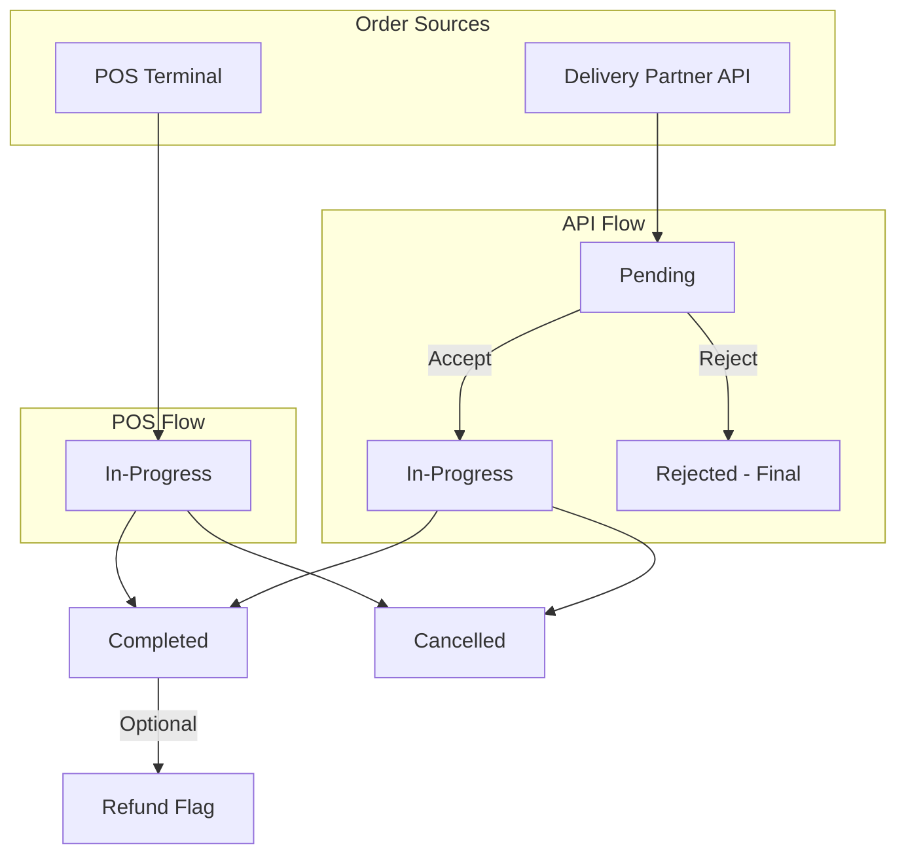

# Order Flow Simplification and Missing Tables

## Summary of Changes

### 1. Database Changes

**Simplify Order Statuses:**

- Current: 9 statuses (pending, confirmed, preparing, ready, out_for_delivery, completed, cancelled, refunded, failed)
- New: 5 statuses only

| Status | For | Description |

|--------|-----|-------------|

| `pending` | API orders only | Order received from delivery partner, awaiting accept/reject |

| `in_progress` | Both | First status for POS orders; API orders after acceptance |

| `completed` | Both | Order fulfilled |

| `cancelled` | Both | Order cancelled (after being in-progress) |

| `rejected` | API orders only | Store rejected the incoming order (never started) |

**Key Difference:**

- **Rejected** = Store said NO to an incoming API order (from Pending → Rejected)
- **Cancelled** = Order was cancelled after work started (from In-Progress → Cancelled)

Refunds will be handled via existing flags: `is_refunded`, `refund_amount`, `refunded_at`

**New Tables to Create:**

1. **`customers`** table:

   - `id`, `business_id`, `branch_id`
   - `name`, `phone`, `email`
   - `address`, `address_lat`, `address_lng`
   - `notes`, `is_active`
   - `created_at`, `updated_at`

2. **`drivers`** table:

   - `id`, `business_id`, `branch_id`
   - `name`, `name_ar`, `phone`, `email`
   - `vehicle_type`, `vehicle_number`
   - `status` (available, busy, offline)
   - `is_active`
   - `created_at`, `updated_at`

### 2. Backend Changes

**Files to modify:**

- [`Silo-system/backend/src/types/index.ts`](Silo-system/backend/src/types/index.ts) - Simplify OrderStatus type to 5 values
- [`Silo-system/backend/src/services/pos.service.ts`](Silo-system/backend/src/services/pos.service.ts) - Update order creation logic, add accept/reject methods
- [`Silo-system/backend/src/api/pos.routes.ts`](Silo-system/backend/src/api/pos.routes.ts) - Add accept/reject order endpoints
- [`Silo-system/backend/src/index.ts`](Silo-system/backend/src/index.ts) - Register new routes

**New files:**

- `Silo-system/backend/src/api/customers.routes.ts` - CRUD for customers (business/branch isolated)
- `Silo-system/backend/src/api/drivers.routes.ts` - CRUD for drivers (business/branch isolated)

### 3. Frontend Changes (Store Setup Web App - localhost:3002)

**Add Drivers management page** to existing store-setup app (Next.js):

**Files to create:**

- `Silo-system/store-setup/app/drivers/page.tsx` - Drivers management page (CRUD)
- `Silo-system/store-setup/lib/drivers-api.ts` - API client for drivers

**Files to modify:**

- [`Silo-system/store-setup/components/sidebar.tsx`](Silo-system/store-setup/components/sidebar.tsx) - Add "Drivers" menu item (below Tables)

**Drivers will be isolated by:**

- `business_id` - Each business has its own drivers
- `branch_id` - Drivers can be assigned to specific branch (optional, NULL = all branches)

### 3b. Mobile App Changes (React Native POS)

**Files to modify:**

- [`Silo-system/business-app/src/screens/POSScreen.tsx`](Silo-system/business-app/src/screens/POSScreen.tsx) - Add customer info popup for delivery orders created via POS

### 4. Order Flow Diagram

**Status Transitions:**

- POS Order: `in_progress` → `completed` OR `cancelled`
- API Order: `pending` → `in_progress` (accept) OR `rejected` (reject)
- After accept: `in_progress` → `completed` OR `cancelled`

### 5. Localization

Add new translation keys for:

- Store Setup screen
- Drivers management
- Customer popup
- New order statuses